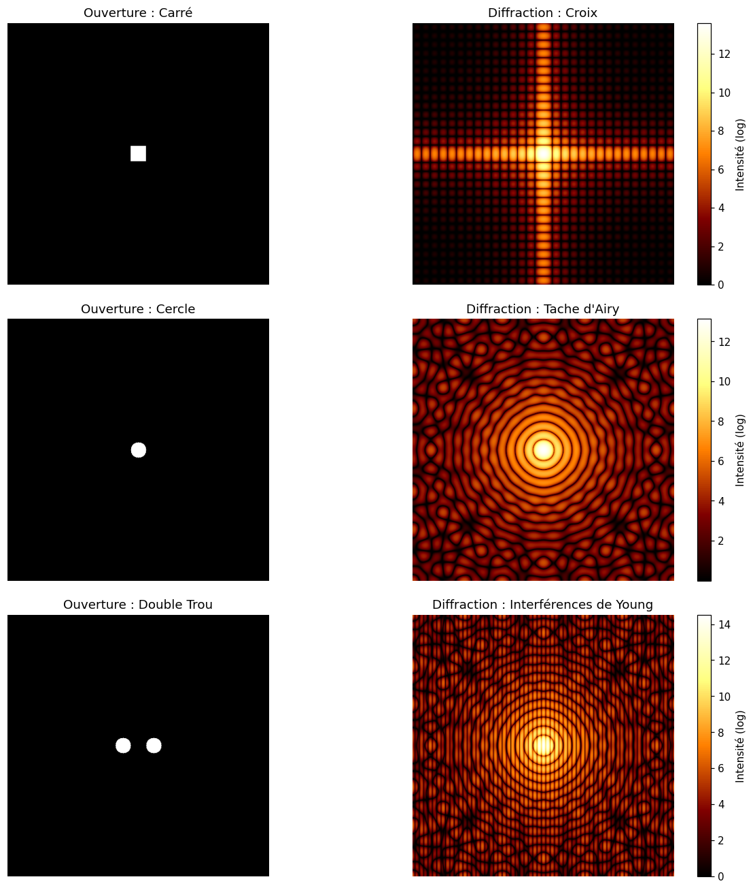

# Fraunhofer diffraction with a hand-written FFT

In the far field, the diffracted amplitude is the Fourier transform of the aperture. This project computes it with a recursive radix-2 Cooley–Tukey FFT written from scratch (no `np.fft.fft2`), on a 512 × 512 grid.

## Method
- 1D FFT by the Danielson–Lanczos lemma (even/odd split, twiddle factors), O(N log N).
- 2D FFT by separability (rows, then columns).
- Intensity |A|² shown on a logarithmic scale to reveal secondary maxima.

## Results
Square aperture: sinc² cross pattern. Circular aperture: Airy pattern. Double aperture: Airy envelope modulated by Young fringes.

## Validation
Run `python validation.py` (grid 512 × 512, aperture size 30 px):

| Check | Theory | Simulation |
|---|---|---|
| Hand-written FFT vs `np.fft.fft2` | — | max relative error 8 × 10⁻¹⁶ (machine precision) |
| Square: first minimum, N/a | 17.07 px | 17 px |
| Circle: first Airy dark ring, 1.22 N/(2R) | 20.82 px | 21 px |
| Double aperture: fringe spacing, N/D | 8.53 px | 8.44 px |

Deviations are at the one-pixel resolution of the grid. The recursive pure-Python FFT takes about 2 s on the 512 × 512 grid, against a few milliseconds for NumPy's optimized FFT: the goal is a transparent, verified implementation, not speed.

## Run
`python fft_diffraction.py` — report (French): [report_fr.pdf](report_fr.pdf). Joint work with Amaury Mulloni.
