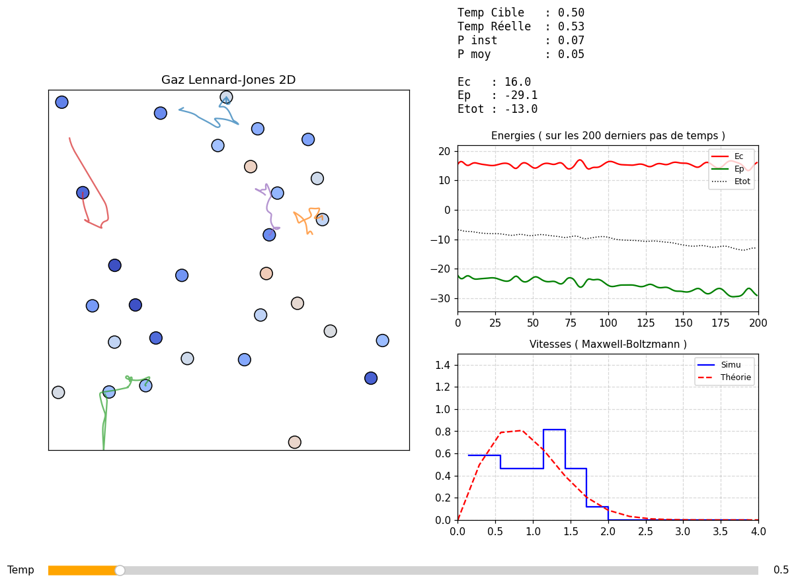

# Molecular dynamics of a 2D Lennard-Jones gas

N = 30 particles in a closed box with reflecting walls, reduced Lennard-Jones units (m = kB = ε = σ = 1). Interactive dashboard: particles colored by speed, energies, speed histogram against the 2D Maxwell–Boltzmann distribution, and a slider for the target temperature.

## Method
- Velocity-Verlet integration, Δt = 0.01; pairwise Lennard-Jones forces using Newton's third law.
- Kinetic temperature from equipartition (T = Ec/N in 2D); pressure from the virial theorem.
- Berendsen-type thermostat to drive the system to the target temperature.

## Results
- Low temperature (T = 0.2): particles condense into a cluster, Ep dominates, pressure ≈ 0.
- High temperature (T = 5): gas-like state filling the box. The virial pressure (2.09) exceeds the ideal-gas value N·T/V = 1.5, as expected when short-range repulsion dominates at high temperature.

## Known limitations
- Energy conservation of the integrator is not tested: the thermostat adds and removes energy, so the total-energy curve drifts (visible above). A run without thermostat (NVE) is needed for that check.
- Distances are capped at r = 0.8 to avoid overlaps from the random initialization; a lattice initialization would remove the need for this.
- The force loop is pure Python, O(N²); fine for N = 30, not for larger systems.

## Run
`python md_lennard_jones.py` — report (French): [report_fr.pdf](report_fr.pdf). Joint work with Amaury Mulloni.
