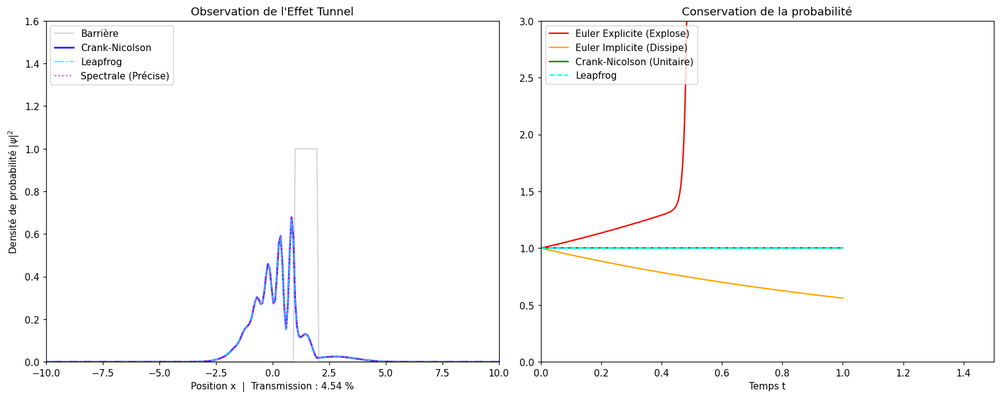

# Time-dependent Schrödinger equation in 1D

A Gaussian wave packet (x0 = -4, σ = 0.8, k0 = 7) hits a rectangular barrier (V0 = 30 on [1, 2]); its mean energy (~24.5) is below the barrier, so transmission is mainly due to tunneling. Units: ħ = m = 1.

## Method
- Space: second-order centered finite differences, N = 250 points on [-10, 10] (Δx ≈ 0.08), tridiagonal Hamiltonian.
- Time: four schemes run side by side, Δt = 0.001:
  - explicit Euler — unconditionally unstable, the norm blows up;
  - implicit Euler — stable but dissipative, the norm decays;
  - Crank–Nicolson (Cayley form) — unitary, the norm stays at 1;
  - leapfrog — conditionally stable. Its stability bound Δt < 1/(2/Δx² + V0) ≈ 0.0029 was checked numerically: Δt = 0.003 diverges.
- Reference: exact time evolution of the discretized Hamiltonian by diagonalization.

## Known limitations
- The implicit schemes use dense matrix inverses; a banded/sparse solver (`scipy.linalg.solve_banded`) would be the standard choice.
- The spectral reference is exact in time for the *discrete* Hamiltonian, so it measures time-integration error only, not spatial error (k0·Δx ≈ 0.56, about 11 points per wavelength).
- No convergence study (error vs Δt) and no comparison of the transmission with the analytical barrier coefficient yet.

## Run
`python schrodinger_1d.py` — report (French): [report_fr.pdf](report_fr.pdf). Joint work with Amaury Mulloni.
