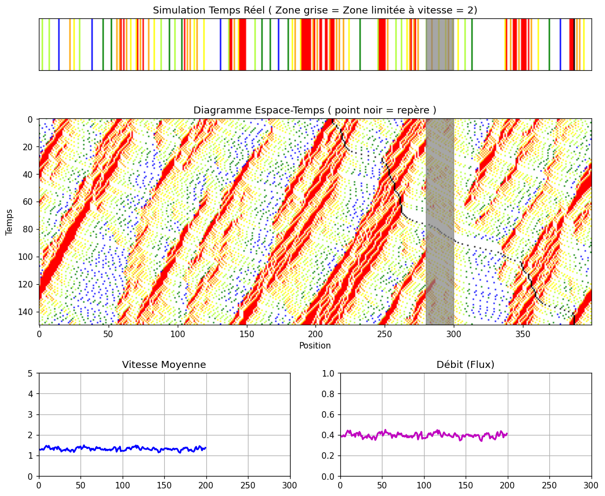
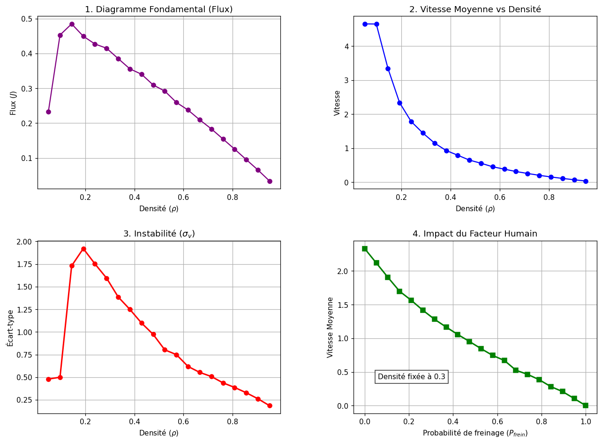

# Traffic flow with the Nagel–Schreckenberg cellular automaton

Ring road of L = 400 cells, v_max = 5, random braking probability p = 0.3, with a work zone (cells 280–300) limited to v = 2.

## Method
- Stochastic cellular automaton with the four Nagel–Schreckenberg rules (acceleration, braking, randomization, motion), parallel update.
- Fully vectorized update with NumPy; periodic boundary conditions through modular arithmetic.
- Statistics: time average over the second half of each run (warm-up discarded).

## Results

- Backward-propagating jam waves (negative slope in the space-time diagram), the discrete counterpart of shock waves in macroscopic traffic models (LWR / Burgers-type conservation laws).
- Fundamental diagram with a free-flow branch and a congested branch, critical density ρc ≈ 0.18 for p = 0.3.
- Peak of velocity fluctuations near ρc, and mean speed decreasing almost linearly with p (density fixed at 0.3).

## Known limitations
- One random realization per density and 300 time steps per run: the curves have no error bars, and ρc is resolved only to the density step (~0.05).

## Run
`python traffic_nasch.py` — close the animation window to start the statistical analysis. Report (French): [report_fr.pdf](report_fr.pdf). Joint work with Amaury Mulloni.
